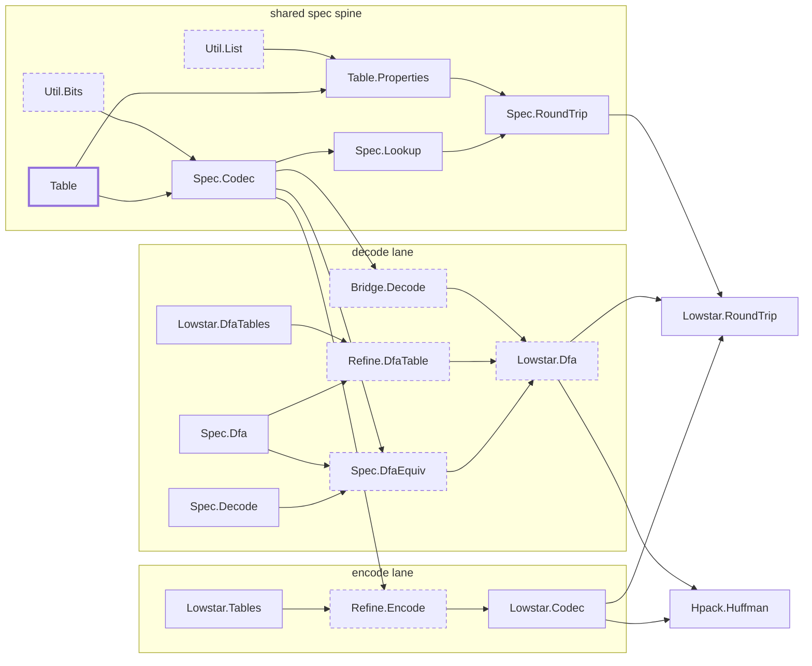

# Verified HPACK Huffman codec — proof architecture

This directory verifies the HPACK Huffman codec (RFC 7541 §5.2 and Appendix B) in
F\*/Low\* and lowers it to the C that `cbits/hpack_huffman.c` calls. The codec is the
Huffman transform of a string's *data* octets: `encode` maps bytes to the Appendix B
bit stream, `decode` maps that bit stream back to bytes. Both directions are proven
correct — `encode` emits exactly the RFC bit stream, and `decode` returns the right
bytes on every valid stream and rejects every invalid one. This document is the map.

## Scope & assumptions

This work is **one leaf** of HPACK: the §5.2 Huffman encode/decode of a single,
already-delimited string — the Appendix B prefix code plus §5.2's byte-boundary padding
and end-of-string rules. It is **one-shot** (a complete string in, the whole result
out) and allocates nothing: the caller owns the `dst` buffer and passes its capacity.

Everything else in HPACK is the caller's job and is **out of scope** here:

- the string's length — an integer (§5.1, "Integer Representation") carried in the §5.2
  header alongside the `H` (Huffman) flag that selects raw vs. Huffman bytes;
- the header-field representations that wrap strings (§6);
- the dynamic table and its eviction / size accounting (§2.3, §4).

In the full HPACK *inflater*, this codec sits exactly at the `READ_HUFF_STRING` leaf
(see *Relationship to the canonical HPACK decoders*); the inflater buffers a
length-delimited string and hands this codec a complete one.

The trust boundary — what the proofs *assume* rather than establish — is the spec code
table, KaRaMeL, the C shim, and F\*/Z3; it is enumerated once under *Trusted computing
base* (and as Stratum 0 of the proof stack), not repeated here.

Throughout, modules are named without their `Hpack.Huffman.` prefix for brevity
(`Spec.Codec` is `Hpack.Huffman.Spec.Codec`, and so on).

## What RFC 7541 requires

The codec refines RFC 7541's normative requirements for Huffman strings; each maps to
the place in the proof that discharges it.

**The code (Appendix B).** A 257-entry prefix code — 256 byte symbols plus the
end-of-string symbol EOS — with code lengths 5–30 bits and EOS = `0x3fffffff` (30 bits,
all ones): *"String literals that use Huffman encoding are encoded with the Huffman code
defined in Appendix B."* The table is transcribed in `Table`, and every structural
property it needs (lengths in range, pairwise prefix-free, EOS value, codes fit their
lengths) is machine-checked in `Table.Properties`.

**Encoder padding.** The bit stream rarely ends on an octet boundary, so §5.2 requires
that *"the most significant bits of the code corresponding to the EOS symbol are used"*
as padding up to the next boundary. EOS is all ones, so that padding is ≤7 all-ones
bits — exactly what `encode` emits and `Spec.RoundTrip.round_trip_padded` proves
correct.

**Decoder rejection.** §5.2 states three conditions a decoder MUST reject; the spec
enforces each one exactly:

- *"A padding strictly longer than 7 bits MUST be treated as a decoding error."*
  → `Spec.Codec.valid_padding_v` requires `nbits <= 7`.
- *"A padding not corresponding to the most significant bits of the code for the EOS
  symbol MUST be treated as a decoding error."*
  → `valid_padding_v` also requires `acc = pow2 nbits - 1`: the leftover bits are all
  ones, the most-significant bits of the all-ones EOS code.
- *"A Huffman-encoded string literal containing the EOS symbol MUST be treated as a
  decoding error."*
  → `Spec.Codec.decode_go` returns `None` the moment a completed codeword is the EOS
  index (`if s = eos_index then None`).

## The spec model

Two pure functions over `list bool` (bit strings, MSB-first), both in `Spec.Codec`, are
the mathematics everything below refines:

- **`encode_bits`** — concatenates each byte's Appendix B code bits, MSB-first, with no
  padding. (The executable `encode` appends the ≤7 all-ones tail described above.)
- **`decode_go`** — the greedy MSB-first decoder: read bits into a `(value, nbits)`
  accumulator; on a codeword match, emit that symbol and reset; reject an in-stream EOS;
  at end-of-input, accept iff the leftover bits are valid padding (`valid_padding_v`).
  `decode_bits` runs `decode_go` from the empty accumulator.

`Spec.RoundTrip.round_trip` proves `decode_bits (encode_bits bs) == Some bs`. The
executable decoder does not run `decode_go` directly — it runs an automaton proven equal
to it.

## The decode automaton, precisely

The decoder is a **deterministic finite automaton (DFA)** over the input bit stream,
specialised to the RFC 7541 Appendix B prefix code:

- **States** — each state is a *reachable partial codeword*: the bits accumulated
  since the last emitted symbol, carried as `(acc, nbits)` (the value and how many
  bits it is), plus one absorbing fail state. In the spec,
  `Spec.Dfa.dstate = DFail | DLive acc nbits`. There are **256 reachable live states
  + 1 fail state = 257** — which is why the transition table is `[257][16]`.
- **Alphabet — a *nibble* (4 bits).** Each transition consumes 4 input bits via one
  table lookup, so a byte is **two** transitions (high nibble, then low) and the
  table is `[states × 16]` (16 = 2⁴). That is the "nibble DFA": bit-at-a-time would be
  `[states × 2]` and 8 steps/byte; byte-at-a-time `[states × 256]`. Nibble is the
  standard space/speed compromise — and the width of nghttp2's table.
- **Transition** (`step : dstate → nibble → dstate × emitted`) — feed the 4 bits
  MSB-first; when the accumulated bits complete a codeword, emit that symbol and reset
  to the start state; if the completed codeword is **EOS**, go to `DFail` (the third
  §5.2 MUST-reject condition above). The shortest code is 5 bits > 4, so a nibble emits
  **0 or 1** byte.
- **Accepting states** (`is_accepting`) — a live `(acc, nbits)` accepts iff it is valid
  end-of-stream padding: `nbits ≤ 7` and `acc` all-ones — the two §5.2 padding
  MUST-reject conditions above. `DFail` never accepts.

The automaton is *defined* in `Spec.Dfa`; `Spec.DfaEquiv.dfa_decode_correct` proves
running it over a nibble sequence equals `decode_go` on the flattened bits — i.e. the
automaton **is** the RFC decoder — and `Refine.DfaTable` proves the generated `[257×16]`
table's cells equal `step`.

### Relationship to the canonical HPACK decoders

In the full HPACK *inflater* state machine that nghttp2, Go's `x/net`, and others
implement (representation dispatch → indexed / literal / table-size-update → per
string, a length + `H`-bit → raw vs. Huffman), this codec is exactly the
**`READ_HUFF_STRING` leaf** — the Huffman decode of one already-delimited string (the
scope boundary above).

State-for-state, this automaton *is* nghttp2's `huff_decode_table[257][16]` FSM
(Pajarola, *Fast Prefix Code Processing*): our `state_of(id)` (id → `(acc, nbits)`) is
the abstraction relation to their node id, our fail state `256` is their `0x100`, and
our per-state `dfa_accept` flag is their `HUFF_ACCEPTED`. The difference is *form, not
function*: ours is **one-shot** (decode a complete string), whereas the canonical
decoders are **resumable** — they carry the same state (`huff_decode_ctx`) across calls
to decode incrementally as bytes arrive. For HPACK that resumability is the *inflater's*
job (it buffers the length-delimited string and hands us a complete one); the automaton
state `cur` here is exactly what a streaming version would carry, so incremental decode
would be a natural extension rather than a redesign.

## The proof-construction stack

The modules form eight strata. Read top-to-bottom they are the whole argument:
*what we assume → the toolkit we prove → the spec → properties of the spec → the
executable artifacts proved equal to the spec → the end-to-end theorem.* Lower
strata are depended on by higher ones; the graph is acyclic. The single source of
truth is the code table in `Hpack.Huffman.Table`; everything else is proved about it
or derived from it and then proved equal to it.

Each `.fsti` interface makes a stratum boundary *enforced*, not merely described: a
consumer sees a module's headline facts, never its proof scaffolding. So the audit
surface is **the `.fsti` files + the spec definitions + the RFC table** — the rest is
machine-checked detail.

### Stratum 0 — Axioms / Trusted Computing Base (assumed, not proven)
- **`Table.hpack_table`** — RFC 7541 Appendix B, transcribed by hand. The one
  substantive piece of trust (Stratum 2 validates everything about it *except* the
  transcription).
- **KaRaMeL + krmllib** — the F\*→C lowering and its runtime headers.
- **The hand-written C shim** `cbits/hpack_huffman.c` (~60 lines) — the `size_t`↔
  `uint32_t` boundary and the `len < 2^27` / `dst_cap` preconditions KaRaMeL erases.
- **F\*/Low\* + Z3** — type-theory soundness and the SMT backend.

The executable table *values/order* and the DFA transition table are **not** here —
they are generated, then proved equal to the spec (Stratum 5). A generator slip
fails `make verify`, it does not ship.

### Stratum 1 — Generic toolkit (RFC-agnostic), `Util.*`
- **`Util.List`** (`.fsti`) — `all_pred`/`all_pred_index`: the element-wise predicate
  combinator behind every per-index table fact.
- **`Util.Bits`** (`.fsti`) — MSB-first bit arithmetic: `code_to_bits`, `value_of`,
  `code_to_bits_split`, and the lynchpin `value_of_code_prefix` (a code prefix's
  value is its top bits) — the source of all decode/encode div/mod reasoning.

### Stratum 2 — Trusted-data validation
- **`Table`** (data) + **`Table.Properties`** — the RFC invariants by normalisation:
  lengths ∈ [5,30], pairwise prefix-free (hence distinct), EOS = `0x3fffffff`/30,
  codes fit their length, plus RFC spot-value anchors. *Verifying `Table.Properties`
  is the validation of the table.*

### Stratum 3 — The specification (definitions; the human-auditable mathematics)
Transparent, so downstream proofs unfold them and the spec stays readable:
- **`Spec.Codec`** — `encode_bits`, `decode_go` (greedy MSB-first decoder),
  `lookup_v`, `valid_padding_v`, `code_of`/`len_of`, `eos_index`.
- **`Spec.Decode`** — the byte↔bit view: `bit_at`/`bits_from`/`bytes_to_bits`.
- **`Spec.Dfa`** — the automaton model: `dstate = DFail | DLive acc nbits`,
  `bit_step`/`bits_step`/`step`/`nibble_bits`/`dfa_run`/`dfa_decode`/`is_accepting`.

### Stratum 4 — Theorems *about the spec* (pure; no executable, no generated data)
- **`Spec.Lookup`** — lookup correctness from prefix-freeness (`lookup_correct`,
  `no_proper_prefix`).
- **`Spec.RoundTrip`** — `round_trip` / `round_trip_padded` (`decode_bits ∘
  encode_bits == id`, incl. ≤7 all-ones padding).
- **`Spec.DfaEquiv`** (`.fsti`) — the headline **`dfa_decode_correct`**
  (`dfa_decode ns == decode_bits (nibbles_to_bits ns)`, i.e. *the automaton equals
  the greedy decoder*) and the per-step `decode_go_nibble` the imperative loop runs
  on. The most interesting FV content in the codec.

### Stratum 5 — Refinement: executable data == spec (discharges Stratum-0 non-trust)
- **`Refine.Encode`** (`.fsti`) — `huff_code_correct`/`huff_len_correct`: each byte's
  committed code/length equals the spec's `code_of`/`len_of`; plus the `enc_bits`
  output lemmas.
- **`Refine.DfaTable`** (`.fsti`) — the DFA's discharge: **`chunk_table_ok`** (every
  one of the 4096 transition cells equals `Spec.Dfa.step`) and **`table_accept_ok`**
  (every accept flag equals `is_accepting`), via a normaliser-fast restatement of the
  step sealed behind the interface.
- **`Bridge.Decode`** (`.fsti`) — the imperative⇄spec bridge: `decoded_prefix` (a
  `dst` buffer prefix as a spec byte list) and the `decode_go` end-conditions the
  loop reasons with.

### Stratum 6 — Executable Low\* (lowered to C)
- **`Lowstar.Tables`** — generated encoder buffers (`huff_code`/`huff_len`).
- **`Lowstar.DfaTables`** — the generated DFA transition table (4096 cells in 16×256
  chunks) + accept flags. DATA ONLY.
- **`Lowstar.Codec`** — `encode`/`encode_len`: memory-safe, length-exact,
  content-correct. (Encode-only; the per-bit decoder was retired once the DFA
  reached parity.)
- **`Lowstar.Dfa`** (`.fsti`) — `decode_dfa` (the shipped decoder), `read_cell` (a
  16-way chunk dispatch → C `switch`), `accept_at`, the per-nibble `dfa_loop`.

### Stratum 7 — End-to-end capstone + ABI
- **`Lowstar.RoundTrip`** — `round_trip_c`: `decode (encode x) == x` on the actual
  extracted C (the executable mirror of `Spec.RoundTrip`).
- **`Hpack.Huffman`** — the public C-ABI facade; KaRaMeL collapses every
  `Hpack.Huffman.*` module into one `Hpack_Huffman.{c,h}`.

Dependency graph. The codec proves two directions over one shared spec, so read it as
two lanes — **encode** and **decode** — branching off a common spec spine and meeting at
the verified round-trip and the C facade. An arrow runs from a module to the ones built
on it. Dashed nodes expose a `.fsti` interface — the audit surface; the bold node is the
one hand-transcribed, trusted input. (The generated tables `Lowstar.Tables` /
`Lowstar.DfaTables` are leaf *inputs* here — emitted, then proved equal to the spec by
`Refine.Encode` / `Refine.DfaTable` — the same role the hand-written `Table` plays for
`Table.Properties`.)

## Proven today

- **Table validity** — the code table satisfies the RFC invariants
  (`Table.Properties`).
- **Pure round-trip** — `decode_bits (encode_bits bs) == Some bs` for any byte string
  (`Spec.RoundTrip`), including the ≤7-bit-padded form the byte decoder faces.
- **The automaton equals the spec decoder** — `dfa_decode == decode_bits ∘
  nibbles_to_bits` (`Spec.DfaEquiv.dfa_decode_correct`): nghttp2's trusted "magic"
  nibble table is, as a mathematical object, exactly the greedy RFC decoder.
- **The generated artifacts equal the spec** — the encoder tables equal
  `code_of`/`len_of` (`Refine.Encode`); every one of the 4096 DFA cells equals
  `Spec.Dfa.step` and every accept flag equals `is_accepting` (`Refine.DfaTable`).
  So the generator is never trusted to get them right.
- **Encode content equality** — `encode`'s output bytes, read MSB-first, are exactly
  `encode_bits` of the input plus ≤7 all-ones padding (`Lowstar.Codec.encode`).
- **Decode functional correctness, both directions** — `decode_dfa`
  (`Lowstar.Dfa`): on every stream the RFC spec accepts (and whose output fits
  `dst_cap`) it returns 0 with exactly the spec's bytes; and on every stream the spec
  *rejects* — including each of §5.2's three MUST-reject conditions — it returns -1 (the
  rejection direction falls out of the DFA's per-state accept/fail classification, not a
  separate proof).
- **End-to-end C round-trip** — `decode (encode x) == x` on the actual extracted
  functions (`Lowstar.RoundTrip.round_trip_c`).

## Trusted computing base

The F\* sources contain no `admit`, `assume`, `magic`, or `--admit_smt_queries`;
nothing is postulated past the type-checker and SMT solver, so the proofs below are
unconditional.

Correctness rests primarily upon the following assumptions:

- **The spec table** `Hpack.Huffman.Table.hpack_table` — the one substantive piece
  of trust (see Stratum 0). Mitigated by `Table.Properties`, the RFC spot-value
  anchors, and the differential tests. Every executable artifact is proved equal to
  this table, so a transcription slip is the only way a wrong code reaches the C.
- **KaRaMeL + krmllib** — the F\*→C lowering and runtime headers.
- **The hand-written C shim** `cbits/hpack_huffman.c` — the `size_t`↔`uint32_t`
  boundary and the precondition guards KaRaMeL erases.

## Performance

Measured **same-machine, same harness**: the verified DFA vs the pre-F\* nghttp2 nibble
FSM, dropped in through the identical `hpack_huffman_*` C ABI so only the
decoder differs. (The figures below were taken in the source monorepo's Haskell-FFI
benchmark; reproduce them standalone with `bench/bench_huffman.c`.) The decode workload
is the encoding of 256 `'a'`s (~320 nibbles).

| operation          | verified       | nghttp2 baseline | ratio |
| ------------------ | -------------- | ---------------- | ----- |
| encode 256 B       | 237 ± 14 ns    | 231 ± 13 ns      | 1.03× |
| encode 128 B       | 115 ± 7 ns     | 107 ± 7 ns       | 1.07× |
| encode 15 B        | 33 ± 2 ns      | 31 ± 2 ns        | 1.05× |
| encode length-only | 48 ± 4 ns      | 49 ± 4 ns        | 1.0×  |
| decode 256 B       | 843 ± 52 ns    | 600 ± 54 ns      | 1.41× |
| decode 128 B       | 402 ± 26 ns    | 290 ± 27 ns      | 1.39× |
| decode 15 B        | 84 ± 7 ns      | 65 ± 4 ns        | 1.28× |

(`±` is tasty-bench's reported 2σ over the sample — same-machine, indicative, not a
cross-platform guarantee. The decode 256 B intervals don't overlap, so the gap is real,
not noise.)

Both meet the project's documented targets (encode <300 ns, decode <1 µs). Encode is at
parity — the proof costs nothing at runtime. The verified DFA decode is a **9× speed-up**
over the per-bit decoder it replaced (7.55 µs/256 B — a binary search per input bit), and
sits ~1.3–1.4× the nghttp2 baseline: the residual gap is the chunked table's per-nibble
dispatch (a 16-way `read_cell` switch over 256-cell chunks) versus a flat
`table[state*16+nib]` index. The chunking is forced by
verification tractability — a single flat 4096-cell `igcmalloc_of_list` has an
O(n²) contents VC that does not terminate in reasonable time (confirmed: a 5-minute
timeout on the declaration alone), whereas 256-cell chunks verify in ~2 s each.

## Future work

- **Wider tables.** An 8-bit (byte-at-a-time) table would trade size for speed under
  the *same* proof structure — only `Refine.DfaTable`'s table grows. Whether it beats
  the chunk-dispatch gap depends on keeping its `igcmalloc_of_list` VC tractable
  (the chunking lesson applies).
- **Flat transition table.** Closing the last ~1.4× to the nghttp2 baseline needs a
  flat 4096-cell array (no per-nibble switch). Blocked today by the O(n²)
  declaration VC above; would need a different by-construction table-build that
  sidesteps `igcmalloc_of_list`'s contents proof.
- **Harmonization.** The codec is self-contained; no spec/encode/decode reconciliation
  remains. `Spec.Decode`'s bit-view is still load-bearing (the loop's simulation is
  stated over it). The natural external step is upstreaming the verified C.

### References

- **[n1] baseline DFA artifact** — nghttp2's `decode_entry[257][16]` table +
  two-nibbles-per-byte loop, the pre-F\* decoder this work replaced (preserved in this
  repo's git history as an early revision of `cbits/hpack_huffman.c`). Credits the table
  to nghttp2 (Tatsuhiro Tsujikawa, MIT), after R. Pajarola, *Fast Prefix Code
  Processing*, 2003. See `NOTICE`.
- **[e1] EverParse** (Delignat-Lavaud et al., USENIX Security 2019) —
  <https://www.usenix.org/conference/usenixsecurity19/presentation/delignat-lavaud>
- **[e2] EverParse / LowParse manual** — <https://project-everest.github.io/everparse/>
- **[h1] HACL\*/F\*: proofs via the normalizer behind interfaces** —
  <https://github.com/project-everest/hacl-star/issues/162>
- **[h2] "Understanding how F\* uses Z3"** —
  <https://fstar-lang.org/tutorial/book/under_the_hood/uth_smt.html>
- **[p1] Fast Huffman decoding design space** — LiteSpeed, *Fast Huffman Decoder*
  (8-bit-at-a-time tables) — <https://blog.litespeedtech.com/2019/09/16/fast-huffman-decoder/>

## Building

From the repo root inside `nix develop` (which provides `fstar.exe`, `krml`, and
`KRML_HOME`) — the root `Makefile` delegates these to `fstar/`:

- `make verify` — type-check the whole proof (the full gate). A successful
  `verify-spec` is the table validation.
- `make tables` — regenerate the executable tables (encoder + DFA transition table)
  from the spec table `Hpack.Huffman.Table.fst`.
- `make generate` — verify, extract to C (two krml passes — the interfaced
  `Lowstar.Dfa` is extracted with its `.fst` as its own root, then merged with the
  facade pass), and vendor into `cbits/generated/`. The committed C lets downstream
  C consumers build with no F\*/krml toolchain.

The C test/bench harness (`test/`, `bench/`) builds against `cbits/` with a C
compiler only (no F\*/krml) — see the repo `README.md`.
